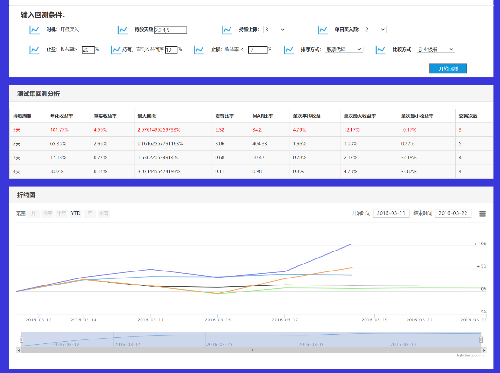
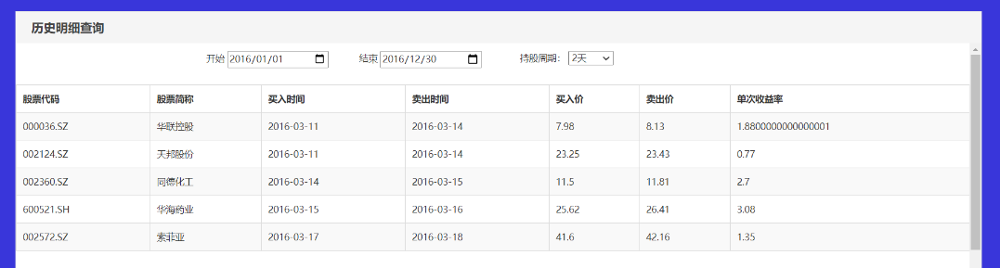

# 股票回测算法

### 背景

​		股票回测算法是我在参与辽宁大学信息学院[周翰逊](https://xueshu.baidu.com/scholarID/CN-BV74BMNJ)老师关于”**股票量化投资**“课题组研究时设计并且实现的，该算法主要是为了实现在**股票回测**过程中对历史股票明细的筛选。

### 概念解释：

​		**股票回测：**是指设定了某些股票指标组合后，基于历史已经发生过的真实行情数据，在历史上某一个时间点开始，严格按照设定的组合进行选股，并模拟真实金融市场交易的规则进行模型买入、模型卖出，得出一个时间段内的[盈利率](https://baike.baidu.com/item/盈利率/503250)、[最大回撤率](https://baike.baidu.com/item/最大回撤率/3645063)等数据。

​		**股票投资策略：**是指每个投资者根据个人习惯会有不同的投资方法，诸如根据热点投资、价值投资、分析技术指标投资等。<u>本项目的股票投资策略主要是采用 分析技术指标投资策略，即根据历史股票数据，结合金融学原理计算相应的指标，然后通过股票回测，从而计算一个回测时间段的收益率等指标</u>。、

### 股票筛选的难点

​		一个投资者进行投资，主要会涉及总持股上限、单日买股上限、正常持股天数、止损、止盈等因素。这些问题综合一起考虑进行投资时，如何正确模拟出历史的股票买卖明细是股票回测的难点。因为受上述因素影响，股票的买卖实际上是一个**<u>高度并行</u>**的过程，类似于图 所示。

​		此外，股票市场是千变万化的，每支股票有自己的特点，比如有的股票会在某些出现停牌等问题，这些问题对于对于该算法的实现与测试都是一个很大的考验。

### 算法大致思想

算法是根据**优先队列**或者**CPU调度算法**的思想做出改进的。

1. 我设置3个队列，分别是：
   1. **选股队列**：用于选择选股，队列中的股票按照<u>买入时间升序排序</u>
   2. **当前持仓队列**：用于存放当前持仓的股票，队列中的股票按照<u>卖出时间升序排序</u>
   3. **历史成交队列**：用于存放从回测时间开始到当前，所有买卖的股票。
2. 根据开始时间，从选股函数中选择股票放入<u>选股队列</u>中。
3. 从<u>选股队列</u>中选择股票放入<u>当前持仓队列和历史成交队列</u>中进行**初次买入**。完成后清空选股队列。
4. 从<u>当前持仓队列</u>中根据卖出时间T**卖出**num支股票，即队列中弹出num支股票，同时T = T + 1；
5. 根据时间T，从选股函数选择股票，放入<u>选股队列</u>中。
6. 从<u>选股队列</u>中选择num支股票，放入<u>当前持仓队列和历史成交队列</u>进行**买入**，同时清空选股队列。
7. <u>循环步骤4，5和6</u>进行买卖，直到时间T超过回测的结束时间退出循环，此时历史成交队列中的股票就是模拟回测的股票历史明细了。

~~由于具体过程比较负责，为了便于理解该算法，我们做如下**假设**：~~

1. ~~总持股上限 M = 3支股票、单日买股上限 N = 2支股票、正常持股天数 T = 3天~~
2. ~~回测开始时间startTime、回测结束时间endTime、历史交易明细的结构体数组tradeHistory~~

~~该算法是基于**<u>优先队列</u>**的思想进行改进。~~

- ~~首先调用函数oneChooseStock()先获取3支股票（即第一天买的2支股票A、B与第二天买的1支股票C ）。将这3支股票放入结构体数组tradeHistory中，随后将该结构体数组按照卖出时间**升序排序**，获取最早卖出时间sellTime 和 卖出的股票数量numS 支。将结构体数组tradeHistory按照买入时间**<u>降序排序</u>**，计算可以买入的时间buyTime，然后更新nowTime。~~
- ~~若当前时间nowTime小于结束时间endTime，执行如下循环：~~
  - ~~根据总持股上限M和卖出数量numS计算下次可以购买的数量：buyNum = M - numS，通过oneChooseStock筛选出数量为buyNum的股票放入结构体数组tradeHistory。~~
  - ~~将结构体数组tradeHistory按照买入时间**<u>降序排序</u>**，获取下次可以购买的时间nextTime。~~
  - ~~将结构体数组tradeHistory按照卖出时间**<u>升序排序</u>**，获取下次可以卖出的时间sellTime。~~
  - ~~根据nextTime和sellTime更新当前时间nowTime~~
- ~~将结构体数组tradeHistory中超过回测结束时间的股票剔除。~~

### 算法伪代码

....

### 实现部分效果图 

​		系统对策略进行回测结束时，会向用户展示回测的结果，回测结果分为三个部分，首先是策略的收益情况与结果指标，用数字表示，然后是策略收益与基准收益（沪深300等等）的对比图，用图表表示，最后是回测时产生的每笔交易的详细信息（回测的历史明细），包括时间、交易股票、交易价格、交易数量等信息，交易详单用表格表示。

